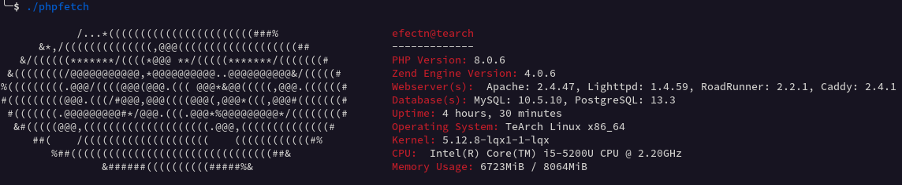

# phpfetch

Simple PHP and System Information Tool  

## Screenshots

## Requirements

 - php ***(min 5.6)***
 
 Note: Only supports GNU/Linux.
 
 - Supporting DBMS: MySQL, PostgreSQL, MongoDB
 - Supporting Webservers: Apache, Nginx, Caddy, Lighttpd, Roadrunner

## Installation

    make install DESTDIR=/

## License

Phpfetch is licensed under the terms of the **GPL-3.0-or-later** (see [LICENSE](LICENSE)).
